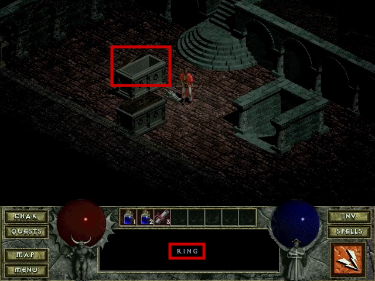
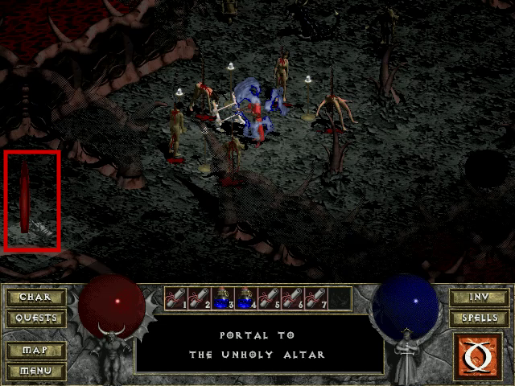

**Analysis of Groobo's _Diablo_ WR Speedrun**

# Abstract

The current world record _Diablo_ speedrun by Groobo (in the 'any% segmented' category) contains significant irregularities which compromise the integrity of the run. This analysis details discoveries quantifying ways the run is provably illegitimate and should be retracted from all records sites, including _Speed Demos Archive_ and _Guinness World Records_.

The speedrun includes the following disqualifying elements:
- Mutually exclusive gameplay behaviors, indicating the run was spliced from multiple playthroughs using at least versions 1.00 and 1.09 of the game
- Segments from unrelated runs that cannot naturally coexist in a single playthrough
- Levels which could only exist through external modifications to the game's mechanics
- Graphical and audio artifacts suggesting video splicing, with some segments notably omitting portions which affect the recorded completion time

**Table of Contents**
[[#Abstract]]
[[#Authors]]
[[#Background]]
[[#Analysis]]
[[#Inconsistent Title Screen Version]]
[[#Inconsistent Main Menu Version]]
[[#Inconsistent Character Menu Music]]
[[#Invalid Dungeon Level Sequence]]
[[#Inconsistent Inventory]]
[[#Impossible Quest Combinations]]
[[#Inaccessible Dungeon Level]]
[[#Inconsistent Item Drop]]
[[#Improbable Item Duplication]]
[[#Inconsistent Music Playback]]
[[#Inconsistent Shop Inventory Rerolling]]
[[#Inconsistent Glitch Use]]
[[#Runtime Discrepancies]]
[[#Conclusion]]
[[#Credits from the Authors]]

# Authors

This document was compiled by dwangoAC (Allan Cecil) and edited by Conlan Brown, based on analysis investigations and input from members of the DevilutionX, Diablo speedrunning, TASBot, and TASVideos communities.

# Background

_Diablo_ was released by Blizzard Entertainment in January, 1997. On January 16, 2009, Maciej 'Groobo' Maselewski ("Groobo") completed an 'any% segmented' category Real-Time Attack (RTA) speedrunning attempt consisting of 27 segments with a completion time of 3 minutes and 12 seconds, listed as a 'Sorcerer run' to differentiate the character class used in the run. The run was submitted by the author to [Speed Demos Archive](https://speeddemosarchive.com/Diablo.html) (SDA) and [Guinness World Records](https://www.guinnessworldrecords.com/world-records/110580-fastest-completion-of-an-rpg-videogame). SDA [reviewed the run](https://forum.speeddemosarchive.com/post/diablo__february_8th_2009.html) and published the submission after completing the verification process. SDA did not identify any concerns, with the discussion primarily focusing on video quality aspects.

_Diablo_ speedrun attempts declined following Groobo's run due to the difficulty replicating or beating the time Groobo reported. The _Diablo_ speedrunning community did not initially question the validity of the run, although some speedrunners such as Funkmastermp eventually expressed doubt about the probability of certain aspects of the run after not encountering similar results despite many years of attempts.

In January 2024, Funkmastermp approached dwangoAC (of the TASbot and TASVideos communities) to create a Tool-Assisted Speedrun (TAS) of _Diablo_. Initial investigations by dwangoAC on Twitch proved a TAS of _Diablo_ was viable by combining the PCem emulator with the libTAS rerecording framework. dwangoAC and Funkmastermp consulted the DevilutionX community to clarify the level generation code behaviors in different versions of _Diablo_. A cross-community team formed to discuss strategies and Groobo's speedrun was used as a basis of the route for the TAS. The team observed inconsistencies that raised concerns about the viability of Groobo's speedrun and led to a more detailed analysis.

The team reached out to an SDA spokesperson to determine if any additional documentation existed about the speedrun. Records from that timeframe were limited and provided no additional historical notes from SDA staff member mikwuyama who performed the verification. The team additionally attempted to contact Groobo via multiple means but received no reply. Lacking additional information, the team shifted focus to assessing the viability of the speedrun based on [Groobo's submitted run video](https://speeddemosarchive.com/demo.pl?Diablo_Sorcerer_312). The team studied the video and cross-referenced the results by consulting the code in the [Devilution decompilation project](https://github.com/diasurgical/devilution).

# Analysis

The team isolated several significant inconsistencies while reviewing the run video frame-by-frame.

All times referenced below are shown in m:ss format and were taken from the video file `Diablo_Sorcerer_312_HQ.mp4` (hosted at [http://dl.speeddemosarchive.com/Diablo_Sorcerer_312_HQ.mp4](http://dl.speeddemosarchive.com/Diablo_Sorcerer_312_HQ.mp4)).

## Inconsistent Title Screen Version

The title screen in the video indicates _Diablo_ version 1.09 was used but the run notes indicate an earlier version was used. At 0:05, the _Diablo_ title screen shows a copyright date of 1996-2001:


_Figure 1: Diablo v1.09 title screen showing 1996-2001 copyright date_

Figure 2 shows the following patch release details:
 - The release date of each version of _Diablo_, including the patch date exactly as written by Blizzard in the `Update.txt` file included with each patch release
- The date the patch was first reported on in the news by [Patches-Scrolls.com](https://www.patches-scrolls.com/)
- The file version and product version included in the metadata of the patched `Diablo.exe` executable
- The date the executable was modified

| **Patch** | **Patch date** | **Reported** | **Exe version** | **Exe product** | **Exe modified** |
| --------- | -------------- | ------------ | --------------- | --------------- | ---------------- |
| 1.00      | (no patch)     | (no patch)   | 1.0.0.0         | 96, 12, 26, 3   | 1996-12-26       |
| 1.02      | 02/25/97       | 1997-02-27   | 1.0.0.0         | 97, 2, 7, 1     | 1997-02-26       |
| 1.03      | 04/01/97       | 1997-01-04   | 1.0.0.0         | 97, 4, 1, 1     | 1997-04-01       |
| 1.04      | 05/30/97       | 1997-06-16   | 1.0.0.0         | 97, 5, 23, 1    | 1997-06-02       |
| 1.05      | 05/14/98       | 1998-06-10   | 1.0.0.0         | 98, 5, 6, 1     | 1998-06-05       |
| 1.07      | 08/25/98       | 1998-09-24   | 1.0.0.0         | 98, 5, 6, 1     | 1998-09-17       |
| 1.08      | 05/23/2000     | 2000-06-16   | 2000.2.2.1      | 1, 0, 8, 1      | 2000-05-23       |
| 1.09      | 05/11/2001     | 2001-06-23   | 2001.5.11.1     | 1, 0, 9, 1      | 2001-05-11       |

_Figure 2 - Table of patch versions and release dates_

The copyright date displayed on the splash screen is embedded within the application. _Diablo_ versions 1.00 through 1.07 display a copyright date of 1996, version 1.08 displays a copyright date of 1996-2000, and 1.09 displays a copyright date of 1996-2001. The title screen copyright date of 1996-2001 indicates this part of the video was recorded using version 1.09 (or the nearly identical sub-version 1.09b).

 However, Groobo's description on the [SDA Diablo page](https://speeddemosarchive.com/Diablo.html) mentions an earlier version, stating the run uses "…the negative health glitch (note that this was fixed with the 1.07 patch)." Groobo's statement indicates he used a version of _Diablo_ prior to 1.07. Earlier versions were released in 1998 and prior and would not have displayed a copyright date of 2001. The team confirmed the negative health glitch, discussed further in [[#Inconsistent glitch use]], is not possible in 1.07 or later. This indicates the run was performed using multiple versions of the game.

## Inconsistent Main Menu Version

The main menu version is inconsistent with the title screen. At 0:12, the _Diablo_ main menu screen appears showing a version of "Diablo v1.00":


_Figure 3 - Diablo v1.00 main menu version_

The version shown on the main menu is also embedded in the application. As described in [[#Inconsistent Main Menu Version]], _Diablo_ 1.00 would have displayed a title screen with a copyright date of 1996, indicating a version difference between the title screen and the main menu screen. This is the first visual indication that additional video segments, or splices, were used.

## Inconsistent Character Menu Music
The character menu version is inconsistent with the main menu screen. At 0:13, the _Diablo_ character select screen appears:


_Figure 4 - Character select screen where no music is playing_

The character select screen has no music playing. *Diablo* 1.05 and later lack music when on the character select screen. This indicates that this portion of the run was performed on a later version of the game, indicating the presence of a video splice between the main menu and the character select menu.

## Invalid Dungeon Level Sequence
Starting at 0:48 in dungeon level (hereafter dlvl) 1 through 1:33 in dlvl 9, each dungeon level has a distance between the entrance stairs and the stairs to the next level consisting of 7 tiles for dlvl 1-4, 5 tiles for dlvl 5-8, and 3 tiles for dlvl 9. Such a favorable sequence does not naturally occur from the map generation in _Diablo_ in any version of the game. The team created [Diablo map generation](https://github.com/Matthew-petroff/diablo-mapgen) analysis tools and performed an exhaustive search of the entire space of all game seeds (which change based on the date and time a new game is started) to identify levels with the shortest walking distance. No date, including invalid dates before 1970 or after 2038 as described in [[#Appendix A Diablo Level Generation|Appendix A: Diablo Level Generation]], creates a seed which produces the sequence of stairs shown in the run.

As Groobo notes in his earlier [17:38 submission](https://archive.org/details/Diablo_Sorcerer_1738) on October 12th, 2006, "...The maps, mosters, drops, chests etc are generated while you create your character, and stay the same every time you play with the same \[character\]…"\[sic\].[^1] _Diablo_ save files include the seed information used to generate dungeon levels; specifically, the initial game seed based on the game launch time is used to generate 16 dungeon seeds, one for each dungeon level, which are stored in the save file.[^2] Because dungeon seeds form part of the save file for a given game, "luck manipulation" of dungeon layouts is not possible. The only way to change the layout for a level is to start a new game or directly modify the game code or save file.

Over the course of several weeks and scan iterations, the team reviewed every possible game seed, including invalid seeds occurring after the year 2038, using `diablo-mapgen --scanner stairs --start 0 --count 4294967295` (with additional scripting to split the search among multiple processor cores). No set of levels matched the results displayed in the run in either the valid or invalid date ranges. This indicates the run was created by using levels from multiple, incongruent playthroughs of the game beyond what would ordinarily be allowed for a segmented speedrun or the run contained directly manipulated dungeon seeds.

Through the search process, the team was able to identify the exact dungeon seed that generated 13 of the 16 levels shown in the video. **Figure 5** shows the dungeon seed for each identified dungeon level and the time and date each playthrough was started. No exact match could be found for dlvl 3 and dlvl 4, which indicates Groobo may have used a modified client or external tools to influence object and monster spawns.

| Dungeon Level | Dungeon Seed   | Game Seed  | Game Start Time     |
| ------------- | -------------- | ---------- | ------------------- |
| 1             | 1342003104     | 1230144506 | 2008-12-24 18:48:26 |
| 2             | 755133500      | 1229972777 | 2008-12-22 19:06:17 |
| 3             |                |            |                     |
| 4             |                |            |                     |
| 5             | 1293295771     | 1229975451 | 2008-12-22 19:50:51 |
| 6             | 2062861350     | 1230145611 | 2008-12-24 19:06:51 |
| 7             | 894816128      | 1230145480 | 2008-12-24 19:04:40 |
| 8             | 1560480383     | 1230145480 | 2008-12-24 19:04:40 |
| 9             | 764458097 [^3] | 1230001659 | 2008-12-23 03:07:39 |
| 10            | 1375523899     | 1229973508 | 2008-12-22 19:18:28 |
| 11            | 651290160      | 1229976092 | 2008-12-22 20:01:32 |
| 12            | 2134483070     | 1230145177 | 2008-12-24 18:59:37 |
| 13            | 723487375      | 1229976431 | 2008-12-22 20:07:11 |
| 14            | 2144005606     | 1229976755 | 2008-12-22 20:12:35 |
| 15            | 1342549707     | 1230053637 | 2008-12-23 17:33:57 |
| 16            | 118068228      | 1230830247 | 2009-01-01 17:17:27 |

_Figure 5: Dungeon seeds and game seeds present in Groobo's run_

The identified games were started between December 22, 2008 and January 1, 2009. Only dlvl 7 and dlvl 8 appeared to be from the same game, indicating the segments were artificially combined from a minimum of 13 different playthroughs.

Save files are encrypted, increasing the difficulty of modifying the dungeon seeds after generation. However, various methods of hooking into the game code are known to exist which could have been used to set a combination of dungeon seeds that wouldn't normally appear together. Modification of specific dungeon seeds is discussed further in [[#Inaccessible Dungeon Level]].

## Inconsistent Inventory

The contents of inventory change unexpectedly throughout the run, indicating splices from multiple playthroughs were used. The Ring of the Vulture is acquired at 1:08 on dlvl 4:


_Figure 6 - Ring of the Vulture acquired on dlvl 4_

However, at 1:30 when the inventory is opened, the ring is not present:


_Figure 7 - Ring of the Vulture missing from inventory_

At 1:55, the ring is present in inventory again:


_Figure 8 - Ring of the Vulture present in inventory_

The ring was initially collected, disappeared, and reappeared which indicates more than one playthrough was used in the run or the run was manipulated in some other way.

## Impossible Quest Combinations

*Diablo* randomly sets which quests are available in each playthrough to enhance replayability.
Two quests that impact speedrunning are "Ogden's Sign" which blocks progress until a quest is completed and "Warlord of Blood" which triggers a scripted sequence. All randomly included quests influence level generation and the quests "Ogden's Sign" and "Warlord of Blood" have a clear visible impact.

The team was able to identify markers of several quests by reviewing Groobo's run. The quest "The Butcher" is available based on the presence of the wounded townsman  0:43:


_Figure 9 - The wounded townsman visible near the entrance to the dungeon_

At 1:06, the player can walk straight to the stairs down on dlvl 4, which indicates the quest "Ogden's Sign" is not active:


_Figure 10 - Level 4 without Ogden's Sign quest_

"The Butcher", "Ogden's Sign", and "Gharbad the Weak" are part of a group of quests, of which only two of the three quests will always be available.[^4] Therefore, the quests "The Butcher" and "Gharbad the Weak" were active during Groobo's run but "Ogden's Sign" was not. Of the 13 levels the team was able to conclusively identify, 9 of them come from games which have "Ogden's Sign" active and would not be able to proceed past dlvl 4 as shown. This indicates the video was formed by splicing multiple runs together.

Additionally, when Groobo returns to town to identify the staff that dropped on dlvl 9 the town well is clean, which indicates the "Poison Water Supply" quest is not available:


_Figure 11 - The return trip to town showing a clean well_

However, the game seed that leads to the version of dlvl 2 shown in the video has the "Poison Water Supply" quest available. This can be identified by the specific structure (The Dark Passage) to the left of the stairs, slightly outside the view in the video, next to the Butcher's red room, as shown in Figure 12:


_Figure 12 - Dungeon level 2 level layout_

These levels cannot exist in the same game even if the dungeon seeds were forced. This indicates multiple runs were spliced together using video editing methods.

The team was also able to identify that the dungeon seeds that lead to dlvl 5, 7, and 8 cannot coexist in the same game. The game seed that generates the version of dlvl 5 shown in the video has a quest called "The Magic Rock" marked not available; if this is marked as available then the objects present in the level change. Dlvl 7 and dlvl 8 are the only two levels that come from the same playthrough, this game has the Halls of the Blind quest unavailable. Both these quests are part of the same quest group, having two quests in the same group unavailable in a single playthrough is not normally possible.

At 1:44 there are no monsters in sight around the stairs down on dlvl 13 (see **Figure 13**), showing that the Warlord of Blood quest is not available. 4 of the games the team was able to identify would have this quest available, meaning the player would not be able to progress through this level as fast as shown. This is another indicator that the video was spliced together from separate playthroughs.


_Figure 13 - No monsters near the stairs down on level 13 due to the Warlord of Blood quest being marked unavailable_

The dungeon seed for dlvl 16 also has an impact on dlvl 4, 8, and 12 due to the game using it to determine where to place a tome on those levels (part of the lore leading up to the fight with Diablo). By setting up the dungeon generation code to use the seed identified for dlvl 16 with the seed identified for dlvl 12 and running through the initial creation of dlvl 12 again the position of objects changes from what's visible in the video. This is another indicator that the video uses splices from different playthroughs.

## Inaccessible Dungeon Level

A dungeon level that can only exist with an invalid date is used. When dlvl 9 was identified, it showed inconsistencies in the video compared to what should have appeared in the game. During the run, two Lava Lords are standing just to the right of the level entrance, but normally they would not have this starting position. Upon killing the first Lava Lord, it drops Naj's Puzzler, an item that gives the player the ability to teleport and makes the rest of the run significantly easier. However, this item would not have been dropped in this situation.

At 1:27, dlvl 9 appears:


_Figure 14 - Dungeon level 9 with nearby stairs and visible Lava Lord_


_Figure 15 - Dungeon level layout identified with map generation tools_

The team used the Diablo map generation tools to conduct additional searches across all valid and invalid games to identify any levels matching what was shown. Only two invalid game seeds produced the starting monster positions seen in the run:

- Game seed `2728353700` corresponding to June, 16 2056 at 04:01:40
- Game seed `3284159136` corresponding to January 26, 2074 at 2:25:36

Both game seed dates are after the year 2038 and cannot be reached without modifications.

Although dlvl 9 is the first level where Naj's Puzzler can drop, there were no games with this level layout where the item would drop without some form of game manipulation.

The team was able to find several candidates for dlvl 3 and 4 with a similar general layout but could not find an exact match for the pattern of tiles seen in the run. It is notable that dlvl 3, 4, and 9 are the only generated levels where Groobo is seen picking up any equipment. This observation suggests a potential correlation between item manipulation and level generation.

While the team identified several potential methods for manipulating the game to achieve the observed outcome of dlvl 9, they were unable to determine which method was most likely due to the diverse nature of possible ways to manipulate the game, and there seemingly being no way to do so from within the game itself.

## Missing Gameplay

Portions of gameplay are missing in multiple locations, although the encoder used may have introduced missing or duplicate frames, complicating analysis. For instance, At 1:28, a single frame of animation is missing. To demonstrate the issue, the team recreated the same movement in the same dlvl 9 layout and took screenshots of each frame during the animation of walking "down" (toward the bottom of the screen) and then turning to walk "up" (toward the top of the screen):


_Figure 16 - First frame of demonstration down to up animation_

In the first frame shown in _Figure 16_, the character is still moving down and has not yet faced away. The second frame shows the beginning of the animation:


_Figure 17 - Second frame of demonstration down to up animation_

The second frame shows the character facing away with their right leg slightly behind their left leg. The third frame moves the character further:


_Figure 18 - Third frame of demonstration down to up animation_

In the third frame, the character's right leg is in front of their left leg after taking a step. Together, these screenshots demonstrate three frames are necessary to move from the starting position to the final position and level orientation. In comparison, Groobo's run shows the following frames:


_Figure 19 - First frame of down to up animation in run_

This first frame from the run shows an identical character placement on-screen compared to the first frame of the demonstration. The second frame from the run shows the character facing away:


_Figure 20 - Second frame of down to up animation in run_

The second frame from the run shows the character's right leg in front of their left. The frame that should be present showing the character's right leg behind their left leg is missing. The game runs at 20 fps which means a single missing frame represents 30 ms of missing gameplay. The team observed similar frames which appear to have been omitted or duplicated during the encoding process throughout the video, complicating frame-by-frame analysis.

This issue is more pronounced after level loading. For example, at 2:58, the red portal is already visible in the first frame upon entering dlvl 15, indicating roughly five frames of missing gameplay:


_Figure 21 - Red portal visible in lower-left_

The same issue is also present at 3:28 where the teleport spell appears to have progressed a few frames when returning from the cutscene.

More significantly, gameplay is entirely missing at other points in the run. This issue becomes evident during interactions with vendors, where simply reentering the shop inventory would not normally trigger item rerolls. This indicates that the required gameplay to generate a new shop seed was omitted, described in [[#Inconsistent Shop Inventory Rerolling]].

These various portions of missing video indicate video splices were used which removed portions of gameplay instead of just removing portions of loading screens. The removed gameplay shortened the calculated run length using the timing method described in [[#Runtime Discrepancies]] and served to further misrepresent the length of the run.

## Inconsistent Item Drop

The item 'Naj's Puzzler' is dropped by an enemy in dlvl 9 but is not present in the dungeon seed. At 1:32, the first Lava Lord is killed and drops 'Naj's Puzzler':


_Figure 22 - Naj's Puzzler item dropped by Lava Lord_

'Naj's Puzzler' is not present in the game seeds outlined in [[#Inaccessible Dungeon Level]]. This indicates the dungeon seed was artificially manipulated.

## Improbable Item Duplication

Items are duplicated in ways that are unlikely in version 1.00 as shown on the main menu screen. At 2:09 and again at 2:11, 'Naj's Puzzler' is duplicated while walking:


_Figure 23 - Item duplication glitch execution_

The duplicated item is visible in the shop view at 2:32:


_Figure 24 - Duplicated item present in shop inventory_

In the 1.00 release, network packets are processed in a tight loop with no timing mechanism. This significantly increases the difficulty of executing the item duplication glitch, which relies on frame perfect input. Item duplication is significantly more viable in versions 1.02 and later where network packets are processed in the main loop at a more consistent 20 FPS. The use of the item duplication glitch indicates the run was either performed on a later version or other tools were used to facilitate executing the glitch.

## Inconsistent Music Playback

The music skips at an improbable time in a way that implies the video was spliced. Starting at 2:31, Adria's shop appears on screen:


_Figure 25 - Shop screen where music audibly skips_

During this segment, the music skips audibly. The music does not skip at the shop under normal circumstances. Reviewing the audio in this section using a spectrogram view in Audacity demonstrates the sudden change in the background music:


_Figure 26 - Spectrogram view of music skip_

In the spectrogram view, the vertical lines at regular intervals on the left are the sound of the player's footsteps. The significant change to a more solid line directly before 2:31.60 is the point where the background music changes abruptly. The further change directly before 2:31.70 is the beginning of the word "I" spoken by the shopkeeper. The audible music skip immediately before the shopkeeper speaks implies video splicing was used at this location.

## Inconsistent Shop Inventory Rerolling

The inventory of shops changes in ways that are not possible in version 1.00 as shown on the menu screen. At 2:35, the shop contains an initial set of items:


_Figure 27 - Initial shop inventory, page 2_

At 2:36, the shop shows different items after re-entering:


_Figure 28 - Changed shop inventory, page 2_

Changing the store inventory as shown requires additional gameplay actions which are not present in the video. This indicates video splicing was used during these segments. Changing the shop inventory in *Diablo* versions 1.00-1.02 requires the player to walk into the dungeon then return to town. When using version 1.03 or later, the player can change the shop inventory by using the pause menu to reload the game from the latest save (saving first to keep bought items). Additionally, the background music skips near the start of the loop as described in [[#Inconsistent Music Playback]], which indicates version 1.03 or later was used here to allow saving and reloading to change the shop.

## Inconsistent Glitch Use

A negative health glitch is used which is not possible in version 1.09 as shown on the title screen. At 3:15 and again at 3:33, the ring is applied to trigger the glitch:


_Figure 29 - Negative health caused by applying ring_

The ring imparts negative health which causes the player to become invulnerable due to a Mana Shield bug. However, the negative health glitch was patched out prior to version 1.09. Specifically, the release notes for version 1.07 state "Fixed the Mana Shield bugs that could make a player invulnerable and/or invisible to other players.", indicating the bug was only present in versions 1.05 and earlier. The use of the glitch indicates an earlier version of the game was used.

## Runtime Discrepancies

Despite the stated game time of 3 minutes and 12 seconds, the recording shows the run starting at 00:16 and ending with the killing of Diablo at 03:38 for a total run time of 3 minutes and 22 seconds. This indicates 10 seconds of gametime was not accounted for in addition to the gametime that should have been included as described in [[#Missing Gameplay]].

## Conclusion

The combination of conflicting factors demonstrate Groobo used illegitimate means to produce the results shown in the run, including using more than one release of _Diablo_, modifying memory directly to create otherwise impossible dungeon level layouts and item drops, and using gameplay-removing video splices.

Throughout the run, a number of artifacts and game behaviors indicate that _Diablo_ version 1.00 is in use as identified on the main menu screen while other portions indicate that _Diablo_ 1.09 is in use as identified on the title screen. Alternately, other versions of _Diablo_ such as 1.04 might have been used for some sections but could not have been used for the entire run as demonstrated by the title screen. Many of the game behaviors and available quests are mutually exclusive, indicating the run was spliced together from multiple playthroughs using at least two different versions of the game. Similarly, the game seed and dungeon seed cannot be generated in legitimate play under any circumstances and indicate external modifications. Finally, A number of graphical and audible artifacts indicate video splices in multiple places, in some cases removing small portions of gameplay in ways that would impact the recorded completion time.

Overall, the team's analysis reveals the run was not possible as Groobo described without disqualifying modifications. The run should therefore be immediately retracted from all leaderboards.

# Credits from the Authors

This analysis was made possible by contributions from members of multiple communities including Devilution / DevilutionX, TASVideos, TASBot, and others using tools including libTAS, PCem, Audacity, IDA, Ghidra + BSim, Binary Ninja, and many other specialized tools written by a number of groups and individuals over the course of nearly three decades. The contributors of this document thank the efforts of the people and projects that made this analysis possible.

Allan Cecil (dwangoAC)is the founder and leader of the TASBot online community and Senior Ambassador on staff of TASVideos.org. He is a published journal author, patent holder, and unflappable presenter with talks at DEF CON, GeekPwn, Thotcon, May Contain Hackers, and other hacker conferences. dwangoAC uses his combined hacking interests for good at charity events like Games Done Quick to entertain viewers with never-before-seen glitches in games, with event content he's led raising more than $1.5m for various charities.

Anders Jenbo, also known as AJenbo, is a seasoned software engineer with over two decades of experience. He specializes in developing and refining complex systems, with notable contributions to the Devilution/DevilutionX project, focusing on documenting and modernizing the Diablo 1 engine. His involvement includes working on the tools for generating and analyzing Diablo 1 dungeons, as well as using his knowledge of the game and its history to identify issues with the run.

Additional authors:
- Staphen
- ephphatha
- Funkmastermp
- kphoenix
- kevans
- other contributors

# Appendix A: Diablo Level Generation

The team reverse-engineered the _Diablo_ executable and determined exactly how the game generates levels for a single playthrough. At a high level, the process involves the following elements:

1. The player chooses to start a new game (either by creating a new character or starting a new playthrough with an existing character)
2. The current date/time (down to the second)[^5] is used to seed the psuedo-random number generator (RNG)
3. 16 consecutive values [^6] (dungeon seeds) are selected from the RNG and recorded in the save file to use when generating a level
4. The 15th dungeon seed is used to randomly deactivate 5 quests
5. When the player visits a level for the first time:
    1. *Diablo* uses the relevant dungeon seed to set the RNG state and generates the dungeon layout (advancing the RNG an indeterminate number of times)
    2. *Diablo* uses the same dungeon seed to reset the RNG state and generates objects/monsters/items, then records their state in the save file (so that if the player picks up an item, kills a monster, etc. they don't respawn when revisiting the level)
6. If the player revisits a level the process is slightly different:
    1. *Diablo* uses the relevant dungeon seed to set the RNG state and generates the dungeon layout
    2. *Diablo* loads the most recent state of the objects/monsters/items from the last time the player was on this level

## Choosing the Initial RNG Seed

To set the initial state when starting a new game the Diablo application uses a C standard library function `time()`. The value returned by this function varies on different platforms. From the decompilation effort, the team was able to determine the implementation used by Diablo returns the number of seconds since Jan 1, 1970 at 00:00:00 as a 32 bit signed integer value. They were also able to isolate the date handling portion of the game seed generation code and determine how it handled the [year 2038 problem](https://en.wikipedia.org/wiki/Year_2038_problem), which is shown in the following code snippet:

```c
//The versions of Visual Studio used to compile Diablo implement time() by calling __loctotime_t()
__loctotime_t(int year, int month, int day, ...) {
uint yearsSince1900 = year - 1900;
**if** (((int)yearsSince1900 < 70) || (138 < (int)yearsSince1900)) {
**return** -1;
```

_Figure 30 - Game seed date handling code in C_

All versions of _Diablo_ contain the date handling code shown in _Figure 30_, which explicitly limits the date range between 1970[^7] (`year - 1900 < 70`) and 2038 (`138 < year - 1900`). This demonstrates that the valid date range where unique maps will be generated in _Diablo_ is from January 1, 1970 at 00:00:00 through December 31, 2038 at 23:59:59. There are ~2177452800 unique starting seeds, meaning only around 2<sup>31</sup> possible combinations of levels are possible and not 2<sup>32*16</sup> as implied by Groobo and some other commentators.

It is now feasible to generate the full game state for all 16 levels in all 2177452800 games ,[^8] which allowed the contributors to identify the exact starting time for 13 of the 16 levels visible in Groobo's submission.

## Generating the Set of Dungeon Seeds

Diablo uses a type of psuedo-random number generator called a [Linear Congruential](https://en.wikipedia.org/wiki/Linear_congruential_generator) [Generator](https://en.wikipedia.org/wiki/Linear_congruential_generator) (LCG). The constants [^9] used by the Diablo application end up defining a sequence of numbers with period 2<sup>32</sup>. The RNG returns values between 0 and 2<sup>32</sup>-1 where every number appears exactly once in a shuffled order and the sequence of values repeats after 2<sup>32</sup> RNG calls.

Each dungeon seed is picked by advancing the RNG state then treating the 32 bit state as a signed integer value and transforming it into a positive integer value between 0 and 2<sup>31</sup> using the C standard library function `abs()` (yielding a 31 bit seed[^10]). The end result is a 16-value wide "window" of the sequence of numbers immediately after the initial RNG state.

Because the dungeon seeds use all but one bit of the RNG state, it's possible to reverse the transformation and determine two possibilities of what the RNG state was given a single dungeon seed. With two dungeon seeds you can determine whether they can occur in the same game and if so exactly what the other dungeon seeds are and what the initial RNG seed (starting time) would have been for that game.

## Generating a Level

Because the dungeon layout for a given game does not change, there's no need to include the full 50KB state in the save file. Instead, the 4-byte dungeon seed can be used to regenerate the level and because the RNG produces the same sequence of numbers all the randomly selected elements will be the same each time the player visits a level. Dungeon layouts are also influenced by what quests are available in the current playthrough, however this is also something that doesn't change mid-playthrough.

Objects, monsters, and items are only generated on the first visit to a level because the player can interact with these elements. If a player defeats a monster, opens a chest, breaks a barrel, or picks up/drops an item the application needs to persist the change for when the player leaves and returns to the level.

## Level Identification Process

The process for identifying a level involves first combining several stills from the video to get as best a view of the given level as possible:


After that the tiles are visually identified and placed in the same pattern as seen.


This tile pattern is then exported from the level editor and fed to the Diablo map generator which then matches each generated level with the given pattern. Usually this is enough to identify a level uniquely. To then locate the specific game seed, object and monster positions are mapped out and an additional search is done to locate the game seed where everything lines up.

# Footnotes

[^1]: Refer to [[#Appendix A Diablo Level Generation|Appendix A]] for specifics on how dungeon layouts and objects/monsters/items are generated.

[^2]: To save space, *Diablo* save files only include the starting RNG state for each of the 16 dungeon seeds the dungeon levels are derived from. Although the game saves the position of items, objects, and monsters once a dungeon level is visited, it always recreates the dungeon layout itself based on the dungeon seed. As described further in [[#Generating the Set of Dungeon Seeds]], these values are derived from 16 consecutive outputs of the global RNG seeded with the current time, with additional restrictions on what date/times are valid when starting a new game (what we call the game seed). Due to the particular type of psuedo-random number generator used in *Diablo*, the possibilities for these 16 dungeon seeds are fairly limited.

[^3]: No game generates monsters in a starting position that would lead to the gameplay shown in the video, and none of the games that generate the dungeon layout shown have the item drop anywhere in the level, let alone from the first monster.

[^4]: Quests are [logically organized in groups](https://github.com/diasurgical/devilution/blob/bbda8dd586c65b03028ec75c52f8ea8627eb9ff5/Source/quests.cpp#L73-L96), with either [one or two quests from each group](https://github.com/diasurgical/devilution/blob/bbda8dd586c65b03028ec75c52f8ea8627eb9ff5/Source/quests.cpp#L155-L158) chosen for each playthrough as shown in a [chart from Jarulf's Guide](http://www.bigd-online.com/JG/Body/JG8-1.html). The first group consisting of the quests "The Curse of King Leoric" and "Poisoned Water Supply" [is handled separately in the code](https://github.com/diasurgical/devilution/blob/bbda8dd586c65b03028ec75c52f8ea8627eb9ff5/Source/quests.cpp#L150-L153)and selects one of the two quests to be active. The next three groups, including the group "The Butcher", "Gharbad the Weak", and "Ogden's Sign", the group "The Magic Rock", "Valor", and "Halls of the Blind", and the group "Zhar the Mad", "The Black Mushroom", and "Anvil of Fury" each select two of the three quests to be active. Finally, the group "Warlord of Blood" and "Lachdanan" selects one quest to be active.

[^5]: The compiler used to build retail versions of *Diablo* further restricts the possible values as described in [[#Choosing the Initial RNG Seed]].

[^6]: Due to the type of psuedo-random number generator used and the range of valid dungeon seeds available, the number of distinct combinations is far smaller than might be expected as described in [[#Generating the Set of Dungeon Seeds]].

[^7]: Windows itself does not allow setting the date earlier than 1980, although this can be worked around in NT-based versions of Windows by setting the clock in the BIOS prior to booting.

[^8]: They ultimately ended up generating all levels, even for impossible dungeon seeds and quest combinations.

[^9]: *Diablo* uses the Borland C++ constants with a 2<sup>32</sup> modulus; the generator function is `int32_t state = 22695477 * state + 1`.

[^10]: Plus an extra value; because the absolute value of -2<sup>31</sup> cannot be represented as a positive signed 32 bit integer, *Diablo* ends up using this value as-is.
