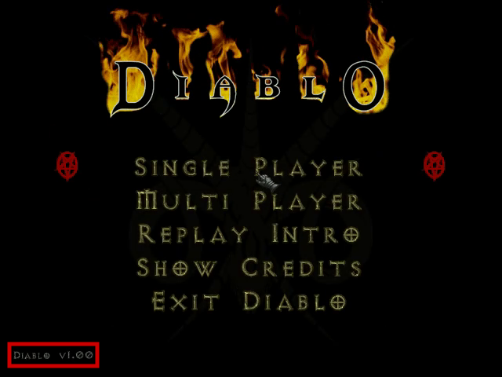

# Analysis of Groobo's Diablo WR Speedrun
# Abstract

The current world record _Diablo_ speedrun by Groobo (in the 'any% segmented' category) contains significant irregularities which compromise the integrity of the run. This analysis demonstrates the run is provably illegitimate and should be retracted from all records sites, including _Speed Demos Archive_ and _Guinness World Records_.

The speedrun includes the following disqualifying elements:
- Visual evidence of both versions 1.00 and 1.09,  indicating the run video was spliced from multiple playthroughs
- Segments from unrelated runs that cannot naturally coexist in a single playthrough
- Levels which could only exist through external modifications to the game's mechanics
- Graphical and audio artifacts suggesting unusual video splicing, including gameplay omissions which affect the recorded completion time

**Table of Contents**

- [[#Abstract|Abstract]]
- [[#Authors|Authors]]
- [[#Background|Background]]
- [[#Analysis|Analysis]]
	- [[#Inconsistent Title Screen Version|Inconsistent Title Screen Version]]
	- [[#Inconsistent Main Menu Version|Inconsistent Main Menu Version]]
	- [[#Inconsistent Character Menu Music|Inconsistent Character Menu Music]]
	- [[#Invalid Dungeon Level Sequence|Invalid Dungeon Level Sequence]]
	- [[#Inconsistent Inventory|Inconsistent Inventory]]
	- [[#Impossible Quest Combinations|Impossible Quest Combinations]]
	- [[#Inaccessible Dungeon Level|Inaccessible Dungeon Level]]
	- [[#Missing Gameplay|Missing Gameplay]]
	- [[#Inconsistent Item Drop|Inconsistent Item Drop]]
	- [[#Improbable Item Duplication|Improbable Item Duplication]]
	- [[#Inconsistent Music Playback|Inconsistent Music Playback]]
	- [[#Inconsistent Shop Inventory Rerolling|Inconsistent Shop Inventory Rerolling]]
	- [[#Inconsistent Glitch Use|Inconsistent Glitch Use]]
- [[#Conclusion|Conclusion]]
- [[#Response|Response]]
- [[#Credits from the Authors|Credits from the Authors]]
- [[#Appendix A - Diablo Level Generation|Appendix A - Diablo Level Generation]]
	- [[#Choosing the Initial RNG Seed|Choosing the Initial RNG Seed]]
	- [[#Generating the Set of Dungeon Seeds|Generating the Set of Dungeon Seeds]]
	- [[#Generating a Level|Generating a Level]]
	- [[#Level Identification Process|Level Identification Process]]
- [[#Appendix B - Diablo Modification Tools|Appendix B - Diablo Modification Tools]]
- [[#Appendix C - SDA Rules|Appendix C - SDA Rules]]
- [[#Footnotes|Footnotes]]

# Authors

This document was compiled by dwangoAC (Allan Cecil) and edited by Conlan Brown, based on analysis investigations and input from members of the DevilutionX, _Diablo_ speedrunning, TASBot, and TASVideos communities including Anders Jenbo (AJenbo), Stephen Wills (staphen), Andrew James (ephphatha), Eric Robinson (kphoenix), Matthew Petroff (Funkmastermp), Kyle Evans (kevans), and other subject matter experts consulted during the investigation.

# Background

_Diablo_ was released by Blizzard Entertainment in January, 1997. On January 16, 2009, Maciej 'Groobo' Maselewski ("Groobo" hereafter) completed an 'any% segmented' category Real-Time Attack (RTA) speedrunning attempt consisting of 27 segments with a completion time of 3 minutes and 12 seconds, listed as a 'Sorcerer run' to differentiate the character class used in the run.[^1] The run was submitted by the author to [Speed Demos Archive](https://speeddemosarchive.com/Diablo.html) (SDA) and appeared in two [Guinness World Records](https://www.guinnessworldrecords.com/world-records/110580-fastest-completion-of-an-rpg-videogame) [entries](https://www.guinnessworldrecords.com/world-records/fastest-completion-of-diablo).  SDA verifiers [reviewing the run](https://forum.speeddemosarchive.com/post/diablo__february_8th_2009.html) in February 2009 did not identify any concerns, including any concerns around the segmented status of the run. The SDA verification discussions primarily focused on video quality aspects. SDA published Groobo's submission on [February 26, 2009](https://speeddemosarchive.com/oldnews09q1.html) after completing the verification process.

_Diablo_ speedrun attempts declined following Groobo's run due to the difficulty of replicating or beating the time Groobo reported. The _Diablo_ speedrunning community did not initially question the validity of the run, although some speedrunners such as Funkmastermp eventually expressed doubt about the probability of certain aspects of the run occurring naturally after not encountering similar results despite many years of attempts.

In January 2024, Funkmastermp approached dwangoAC (of the TASbot and TASVideos communities) to create a Tool-Assisted Speedrun (TAS) of _Diablo_. Initial investigations by dwangoAC on Twitch proved a TAS of _Diablo_ was viable by combining the PCem emulator with the libTAS rerecording framework. dwangoAC and Funkmastermp consulted the DevilutionX community to clarify the level generation code behaviors in different versions of _Diablo_. A cross-community team formed to discuss strategies and Groobo's 2009 speedrun was used as a basis of the route for the TAS. The team observed inconsistencies that raised concerns about the viability of Groobo's speedrun and prompted a more detailed analysis.

The team reached out to an SDA spokesperson to determine if any additional documentation existed about the speedrun. Records from that timeframe were limited and provided no additional historical notes from SDA staff member mikwuyama who performed the verification.[^2] The team additionally attempted to contact Groobo via multiple channels but received no reply. Lacking additional information, the team shifted focus to assessing the viability of the speedrun based on [Groobo's submitted run video](https://speeddemosarchive.com/demo.pl?Diablo_Sorcerer_312). The team studied the video and cross-referenced the results by consulting the code in the [Devilution decompilation project](https://github.com/diasurgical/devilution) repository.

## On Cheating

Speedrunning and Tool-Assisted Speedrunning are often considered a form of e-sport, complete with expectations of fair play and honest competition. Archives and leaderboards have been created during the hobby's history with the specific intention of keeping real records and reflecting honest runs for the sake of truthful competition. Checking and verifying runs, even after the fact, as a means of identifying cheating is an important part of the speedrunning community fair play standards. Cheating has never been an accepted part of the hobby and attempts to keep the hobby free of cheating is an essential part of the health and wellbeing of the hobby itself. 

Splicing, or the act of editing together videos from multiple runs, has been considered cheating since the inception of the hobby. Completing a run but not adhering to the category has also always been considered cheating. Run videos from SDA, including Groobo's run, included the banner "Verified: No Cheating", reflecting the community values in 2009.

The site further included this verbiage in the rules: "Once a speedrun has been published on SDA, it will be hosted until it's obsoleted by another run or if there are doubts about the validity of the speedrun (for example cheating, inconsistencies in segmentation or not sticking to the category rules). The obsoleted run will still be available on archive.org, though."

# Analysis

The team isolated significant inconsistencies while reviewing the run video frame-by-frame and compiled the findings in order of first appearance. All times referenced below are shown in m:ss format and were taken from the video file `Diablo_Sorcerer_312_HQ.mp4` (hosted by SDA at [http://dl.speeddemosarchive.com/Diablo_Sorcerer_312_HQ.mp4](http://dl.speeddemosarchive.com/Diablo_Sorcerer_312_HQ.mp4)).

## Inconsistent Title Screen Version

The title screen in the video indicates _Diablo_ version 1.09 was used but the run notes indicate an earlier version was used. At 0:05, the _Diablo_ title screen shows a copyright date of 1996-2001:


###### _Figure 1 - Diablo V1.09 Title Screen Showing 1996-2001 Copyright date_

_Figure 2_ shows the following patch release details:
 - The release date of each version of _Diablo_, including the patch date exactly as written by Blizzard in the `Update.txt` file included with each patch release
- The date the patch was first reported on in the news by [Patches-Scrolls.com](https://www.patches-scrolls.com/)
- The file version and product version included in the metadata of the patched `Diablo.exe` executable
- The date the executable was modified

| **Patch** | **Patch date** | **Reported** | **Exe version** | **Exe product** | **Exe modified** |
| --------- | -------------- | ------------ | --------------- | --------------- | ---------------- |
| 1.00      | (no patch)     | (no patch)   | 1.0.0.0         | 96,12,26,3      | 1996-12-26       |
| 1.02      | 02/25/97       | 1997-02-27   | 1.0.0.0         | 97,2,7,1        | 1997-02-26       |
| 1.03      | 04/01/97       | 1997-01-04   | 1.0.0.0         | 97,4,1,1        | 1997-04-01       |
| 1.04      | 05/30/97       | 1997-06-16   | 1.0.0.0         | 97,5,23,1       | 1997-06-02       |
| 1.05      | 05/14/98       | 1998-06-10   | 1.0.0.0         | 98,5,6,1        | 1998-06-05       |
| 1.07      | 08/25/98       | 1998-09-24   | 1.0.0.0         | 98,5,6,1        | 1998-09-17       |
| 1.08      | 05/23/2000     | 2000-06-16   | 2000.2.2.1      | 1,0,8,1         | 2000-05-23       |
| 1.09      | 05/11/2001     | 2001-06-23   | 2001.5.11.1     | 1,0,9,1         | 2001-05-11       |
###### _Figure 2 - Table of Patch Versions and Release dates_

The copyright date displayed on the splash screen is embedded within the application. _Diablo_ versions 1.00 through 1.07 display a copyright date of 1996, version 1.08 displays a copyright date of 1996-2000, and 1.09 displays a copyright date of 1996-2001. The title screen copyright date of 1996-2001 indicates this part of the video was recorded using version 1.09 (or the nearly identical sub-version 1.09b).

 However, Groobo's description on the [SDA Diablo page](https://speeddemosarchive.com/Diablo.html) mentions an earlier version, stating the run uses "…the negative health glitch (note that this was fixed with the 1.07 patch)." Groobo's statement indicates he used a version of _Diablo_ prior to 1.07. Earlier versions were released in 1998 and prior and would not have displayed a copyright date of 2001. The team confirmed the negative health glitch, discussed further in [[#Inconsistent Glitch Use|Inconsistent Glitch Use]], is not possible in 1.07 or later. This indicates the run was performed using multiple versions of the game, inconsistent with the run's description when read by other speedrunners.

## Inconsistent Main Menu Version

The main menu version is inconsistent with the title screen. At 0:12, the _Diablo_ main menu screen appears showing a version of "Diablo v1.00":


###### _Figure 3 - Diablo V1.00 Main Menu version_

The version shown on the main menu is also embedded in the application. As described in [[#Inconsistent Main Menu Version|Inconsistent Main Menu Version]], _Diablo_ 1.00 would have displayed a title screen with a copyright date of 1996, indicating a version difference between the title screen and the main menu screen. This is the first visual indication that additional video segments, or splices, were used.

## Inconsistent Character Menu Music
The character menu version is inconsistent with the main menu screen. At 0:13, the _Diablo_ character select screen appears:


###### _Figure 4 - Character Select Screen where no Music is playing_

The character select screen has no music playing. _Diablo_ 1.05 and later lack music when on the character select screen. This indicates the segment was performed on a later version of the game and is evidence of a likely video splice between the main menu and the character select menu.

## Invalid Dungeon Level Sequence
Starting at 0:48 in dungeon level 1 (dlvl hereafter) through 1:33 in dlvl 9, each dungeon level has a distance between the entrance stairs and the stairs to the next level consisting of 7 tiles for dlvl 1-4, 5 tiles for dlvl 5-8, and 3 tiles for dlvl 9. Such a favorable sequence does not naturally occur from the map generation in _Diablo_ in any version of the game. The team created [Diablo map generation](https://github.com/Matthew-petroff/diablo-mapgen) analysis tools and performed an exhaustive search of the entire space of all game seeds (which change based on the date and time a new game is started) to identify levels with the shortest walking distance. No date, including invalid dates before 1970 or after 2038 as described in [[#Appendix A - Diablo Level Generation]], creates a seed which produces the sequence of stairs shown in the run.

As Groobo notes himself in his earlier [17:38 submission](https://archive.org/details/Diablo_Sorcerer_1738) on October 12th, 2006, "...The maps, mosters \[sic\], drops, chests etc are generated while you create your character, and stay the same every time you play with the same \[character\]…". _Diablo_ save files include the seed information used to generate dungeon levels.[^3] Specifically, the initial game seed based on the game launch time is used to generate 16 dungeon seeds, one for each dungeon level, which are stored in the save file.[^4] Because dungeon seeds form part of the save file for a given game, "luck manipulation" of dungeon layouts is not possible. The only way to change the layout for a level is to start a new game or directly modify the game code or save file.

Over the course of several weeks and scan iterations, the team reviewed every possible game seed, including invalid seeds occurring after the year 2038, using `diablo-mapgen --scanner stairs --start 0 --count 4294967295` (with additional scripting to split the search among multiple processor cores). No set of levels matched the results displayed in the run in either the valid or invalid date ranges. This indicates the run was either created by using levels from multiple incongruent playthroughs of the game beyond what would ordinarily be allowed for a segmented speedrun or the run contained directly manipulated dungeon seeds.

Through the search process, the team was able to identify the exact dungeon seed that generated 13 of the 16 levels shown in the video. _Figure 5_ shows the dungeon seed for each identified dungeon level and the time and date each playthrough was started. No exact match could be found for dlvl 3 and dlvl 4 with only a partial match for dlvl 9, which indicates Groobo may have used a modified client or external tools to influence object and monster spawns for those two dungeon levels. [^5]

| Dlvl | Dungeon Seed | Game Seed  | Game Start Time     |
| ---- | ------------ | ---------- | ------------------- |
| 1    | 1342003104   | 1230144506 | 2008-12-24 18:48:26 |
| 2    | 755133500    | 1229972777 | 2008-12-22 19:06:17 |
| 3    |              |            |                     |
| 4    |              |            |                     |
| 5    | 1293295771   | 1229975451 | 2008-12-22 19:50:51 |
| 6    | 2062861350   | 1230145611 | 2008-12-24 19:06:51 |
| 7    | 894816128    | 1230145480 | 2008-12-24 19:04:40 |
| 8    | 1560480383   | 1230145480 | 2008-12-24 19:04:40 |
| 9    | 764458097    | 1230001659 | 2008-12-23 03:07:39 |
| 10   | 1375523899   | 1229973508 | 2008-12-22 19:18:28 |
| 11   | 651290160    | 1229976092 | 2008-12-22 20:01:32 |
| 12   | 2134483070   | 1230145177 | 2008-12-24 18:59:37 |
| 13   | 723487375    | 1229976431 | 2008-12-22 20:07:11 |
| 14   | 2144005606   | 1229976755 | 2008-12-22 20:12:35 |
| 15   | 1342549707   | 1230053637 | 2008-12-23 17:33:57 |
| 16   | 1993034597   | 1230059906 | 2008-12-23 19:18:26 |
###### _Figure 5 - Dungeon Seeds and Game Seeds Present in Groobo's run_

The identified games were all started between December 22, 2008 and December 24, 2008 in the weeks directly prior to his January 16, 2009 submission. Only dlvl 7 and dlvl 8 appeared to be from the same game, indicating the segments were artificially combined from a minimum of 13 different playthroughs.

Save files are encrypted, increasing the difficulty of modifying the dungeon seeds after generation. However, various methods of hooking into the game code are known to exist as described in [[#Appendix B - Diablo Modification Tools]] which could have been used to induce a combination of dungeon seeds that wouldn't normally appear together. Modification of specific dungeon seeds is discussed further in [[#Inaccessible Dungeon Level|Inaccessible Dungeon Level]] and additional level inconsistencies are discussed in [[#Impossible Quest Combinations|Impossible Quest Combinations]].

## Inconsistent Inventory

The contents of inventory change unexpectedly throughout the run, indicating splices from multiple playthroughs were used. The Ring of the Vulture is acquired at 1:08 on dlvl 4:


###### _Figure 6 - Ring of the Vulture Acquired from Upper Sarcophagus on Dlvl 4_

However, at 1:30 when the inventory is opened, the ring is not present:


###### _Figure 7 - Ring of the Vulture Missing from inventory_

At 1:55, the ring is present in inventory again:


###### _Figure 8 - Ring of the Vulture Present in inventory_

The ring is initially collected, disappears, and reappears which indicates more than one playthrough was used in the run or the run was manipulated in some other way.

## Impossible Quest Combinations

Multiple quests show inconsistencies compared to what is normally possible in a single playthrough. _Diablo_ splits quests into groups, with one quest from each group randomly selected to be inactive at the start of each playthrough:[^6]

| Quests groups                                       |
| --------------------------------------------------- |
| Poisoned Water Supply, The Curse of King Leoric     |
| The Butcher, Gharbad the Weak, Ogden’s Sign         |
| The Magic Rock, Arkaine’s Valor, Halls of the Blind |
| Zhar the Mad, The Black Mushroom, Anvil of Fury     |
| Warlord of Blood, Lachdanan                         |
###### _Figure 9 - Groups of Quests where One quest Will Always Be unavailable_

For example, either 'Poisoned Water Supply' or 'The Curse of King Leoric' would be active, while the other quest would be inactive and unavailable. However, based on analysis of identified dungeon seeds, some quests break this pattern while others appear to be inactive in earlier parts of the run but active in later sections.

### Poisoned Water Supply quest Availability

At 2:04, the town well is clean, which indicates the "Poison Water Supply" quest is not available:


###### _Figure 10 - The return Trip to Town Showing a Clean well_

However, the quest was active in dlvl 2 in the game seed Groobo used. The team used the command `diablo-mapgen --start 1229972777 --target 2 --export` to view the maps of the game seed that produces the dlvl 2 dungeon layout shown in the video at 0:53:


###### _Figure 11 - Stairs and Surrounding Area of Dlvl 2_

A structure, The Dark Passage, is present to the left of the stairs next to the Butcher's red room. The presence of the structure just out of view at 0:53 indicates the "Poison Water Supply" quest is available, contradicting the presence of the clean well seen at 2:03.

### Ogden's Sign quest Availability

At 1:06, the stairs down to dlvl 5 are unobstructed. This indicates the quest "Ogden's Sign" is not active; if "Ogden's Sign" were active, the stairs would be encased behind walls.


###### _Figure 12 - Unobstructed Stairs Leading down to Dlvl 5_

However, the team found a majority of levels including dlvl 5 itself came from sessions where this quest would have been active. The quest lengthens runs as the player must either complete the quest or find a scroll to teleport across the wall to proceed, indicating a probable motive for ensuring it was unavailable.

### Warlord of Blood quest Availability

Similarly, at 1:44 the stairs down on dlvl 13 is not blocked by a monster:


###### _Figure 13 - No Monsters near Stairs down on Level 13_

This indicates that the "Warlord of Blood" quest is not available. The quest was available in four of the games the team was able to identify, meaning the player would not be able to progress through this level as fast as shown.

### Incorrect Number of Active Quests in Group

The dungeon seeds matching the levels for "The Magic Rock" and "Halls of the Blind" quests show both quests as being absent. Since they are part of the same quest group, only one of the quests should have been inactive, which is another indicator that video segments from unrelated playthroughs were spliced together to form the run.

The dungeon seed for dlvl 16 also has an impact on dlvl 4, 8, and 12 due to the game using it to determine where to place a tome on those levels (part of the lore leading up to the fight with Diablo). By setting up the dungeon generation code to use the seed identified for dlvl 16 with the seed identified for dlvl 12 and running through the initial creation of dlvl 12 again, the team found the position of objects changed from what is visible in the video.

The combination of quests the team observed is impossible based on the conflicts between visible evidence and what is present in the dungeon levels from the identified game seeds. No viable explanation exists for these discrepancies even for a segmented run, indicating external modifications were used.

## Inaccessible Dungeon Level

A dungeon level that can only exist with an invalid date is used. When dlvl 9 was identified, it showed inconsistencies in the video compared to what should have appeared in the game as described in [[#Inconsistent Item Drop|Inconsistent Item Drop]]. During the run, two Lava Lords are standing just to the right of the level entrance, but the monsters would not normally have this starting position.

At 1:27, dlvl 9 appears:


###### _Figure 14 - Dungeon Level 9 with Nearby Stairs and Visible Lava Lord_


###### _Figure 15 - Dungeon Level Layout Identified with Map Generation tools_

The team used the _Diablo_ map generation tools to conduct additional searches across all valid and invalid games to identify any levels matching what was shown. Only two invalid game seeds produced the starting monster positions seen in the run:

- Game seed `2728353700` - June, 16 2056 at 04:01:40
- Game seed `3284159136` - January 26, 2074 at 2:25:36

Both game seed dates are after the year 2038 and cannot be reached without modifications.

Although dlvl 9 is the first level where Naj's Puzzler can drop, there were no games with this level layout where the item would drop without some form of game manipulation.

As noted in [[#Invalid Dungeon Level Sequence|Invalid Dungeon Level Sequence]], the team was able to find several candidates for dlvl 3 and 4 with a similar general layout but could not find an exact match for the pattern of tiles seen in the run. It is notable that dlvl 3, 4, and 9 are the only generated levels where Groobo is seen picking up any equipment. This observation suggests a potential correlation between item manipulation and level generation.

In a [previous segmented speedrun](https://archive.org/details/Diablo_Sorcerer_607) of *Diablo*, Groobo states "you can't manipulate drops though, because they're generated upon character creation". However, Groobo's 2009 run notes state "The most important thing is that I manipulated Naj's Puzzler to drop from the earliest monster possible", which appears to contradict the previous statement. The team was unable to find any method in any version of Diablo to manipulate item drops from enemies, aligning with Groobo's previous comments.

While the team identified several potential methods for manipulating the game to achieve the observed outcome of dlvl 9, it was not possible to establish which specific method was used, although the team did not discover any legitimate methods to do so from within the game itself. For additional details, see [[#Appendix B - Diablo Modification Tools]].

## Missing Gameplay

Portions of gameplay are missing in multiple locations, although the encoder used may have introduced missing or duplicate frames, complicating analysis. For instance, At 1:28, a single frame of animation is missing. To demonstrate the issue, the team recreated the same movement in the same dlvl 9 layout and took screenshots of each frame during the animation of walking "down" (toward the bottom of the screen) and then turning to walk "up" (toward the top of the screen):


###### _Figure 16 - First Frame of Demonstration down to up animation_

In the first frame shown in _Figure 16_, the character is still moving down and has not yet faced away. The second frame shows the beginning of the animation:


###### _Figure 17 - Second Frame of Demonstration down to up animation_

The second frame shows the character facing away with their right leg slightly behind their left leg. The third frame moves the character further:


###### _Figure 18 - Third Frame of Demonstration down to up animation_

In the third frame, the character's right leg is in front of their left leg after taking a step. Together, these screenshots demonstrate three frames are necessary to move from the starting position to the final position and level orientation. In comparison, Groobo's run shows the following frames at 1:28:


###### _Figure 19 - First Frame of down to up Animation in run_

This first frame from the run shows an identical character placement on-screen compared to the first frame of the demonstration. The second frame from the run shows the character facing away:


###### _Figure 20 - Second Frame of down to up Animation in run_

The second frame from the run shows the character's right leg in front of their left. The frame that should be present showing the character's right leg behind their left leg is missing. The game runs at 20 fps which means a single missing frame represents 30 ms of missing gameplay. The team observed similar frames which appear to have been omitted or duplicated during the encoding process throughout the video, complicating frame-by-frame analysis.

However, gameplay is entirely missing at other points in the run in ways that cannot be explained by this encoder behavior. For example, at 2:58, the red portal is already visible in the first frame upon entering dlvl 15, indicating roughly five frames of missing gameplay:


###### _Figure 21 - Red Portal Visible in lower-left_

The same issue is also present at 3:28 where the teleport spell appears to have progressed a few frames when returning from the cutscene.

Gameplay is entirely missing at other points in the run. This issue becomes evident during interactions with vendors, where simply reentering the shop inventory would not trigger item rerolls. This indicates that the required gameplay to generate a new shop seed was omitted as described in [[#Inconsistent Shop Inventory Rerolling|Inconsistent Shop Inventory Rerolling]].

These various portions of missing video indicate video splices were used which removed portions of gameplay instead of just removing portions of loading screens. The removed gameplay shortened the calculated run length using the SDA timing method and served to further misrepresent the length of the run.

## Inconsistent Item Drop

The item 'Naj's Puzzler' is dropped by an enemy in dlvl 9 but is not present in the dungeon seed. At 1:32, the first Lava Lord is killed and drops 'Naj's Puzzler':


###### _Figure 22 - Naj's Puzzler Item Dropped by Lava Lord_

'Naj's Puzzler' is not present in the game seeds outlined in [[#Inaccessible Dungeon Level|Inaccessible Dungeon Level]]. This indicates the dungeon seed was artificially manipulated.

## Improbable Item Duplication

Items are duplicated in ways that are unlikely in version 1.00 as shown on the main menu screen. At 2:09 and again at 2:11, 'Naj's Puzzler' is duplicated while walking:


###### _Figure 23 - Item Duplication Glitch execution_

The duplicated item is visible in the shop view at 2:32:


###### _Figure 24 - Duplicated Item Present in Shop inventory_

In the 1.00 release, the game logic for item handling operates in a tight loop with no timing mechanism. This significantly increases the difficulty of executing the item duplication glitch, which relies on frame perfect input. Item duplication is significantly more viable in versions 1.02 and later where item handling logic occurs the main loop at a more consistent 20 FPS. The use of the item duplication glitch indicates the run was either performed on a later version or other tools were used to facilitate executing the glitch.

## Inconsistent Music Playback

The music skips at an improbable time in a way that implies the video was spliced. Starting at 2:31, Adria's shop appears on screen:


###### _Figure 25 - Shop Screen where Music Audibly skips_

During this segment, the music skips audibly in a manner which does not occur under normal circumstances. Reviewing the audio in this section using a spectrogram view in Audacity demonstrates the sudden change in the background music:


###### _Figure 26 - Spectrogram view of Music skip_

In the spectrogram view, the vertical lines at regular intervals on the left are the sound of the player's footsteps. The significant change to a more solid line directly before 2:31.60 is the point where the background music changes abruptly. The further change directly before 2:31.70 is the beginning of the word "I" spoken by the shopkeeper. The audible music skip immediately before the shopkeeper speaks implies video splicing was used at this location.

## Inconsistent Shop Inventory Rerolling

The inventory of shops changes in ways that are not possible in version 1.00 as shown on the menu screen. At 2:35, the shop contains an initial set of items:


###### _Figure 27 - Initial Shop Inventory, Page 2_

At 2:36, the shop shows different items after re-entering:


###### _Figure 28 - Changed Shop Inventory, Page 2_

Changing the store inventory as shown requires additional gameplay actions which are not present in the video. Changing the shop inventory in _Diablo_ versions 1.00-1.02 requires the player to walk into the dungeon then return to town. When using version 1.03 or later, the player can change the shop inventory by using the pause menu to reload the game from the latest save (saving first to keep bought items). This indicates video splicing was used during these segments.

Additionally, the background music skips near the start of the loop as described in [[#Inconsistent Music Playback|Inconsistent Music Playback]], which indicates version 1.03 or later was used here to allow saving and reloading to change the shop. No saving or loading was included in the video, impacting the integrity of the run length as described in [[#Missing Gameplay|Missing Gameplay]].

## Inconsistent Glitch Use

A negative health glitch is used which is not possible in version 1.09 as shown on the title screen. At 3:15 and again at 3:33, the ring is applied to trigger the glitch:


###### _Figure 29 - Negative Health Caused by Applying ring_

The ring imparts negative health which causes the player to become invulnerable due to a Mana Shield bug. However, the negative health glitch was patched out prior to version 1.09. Specifically, the release notes for version 1.07 state "Fixed the Mana Shield bugs that could make a player invulnerable and/or invisible to other players.", indicating the bug was only present in versions 1.05 and earlier. The use of the glitch indicates an earlier version of the game was used during these segments.

## Conclusion

The combination of conflicting factors demonstrate Groobo used illegitimate means to produce the results shown in the run, including using more than one release of _Diablo_, modifying memory directly to create otherwise impossible dungeon level layouts and item drops, combining gameplay from different runs, and using gameplay-removing video splices.

Throughout the run, a number of artifacts and game behaviors indicate that _Diablo_ version 1.00 is in use as identified on the main menu screen while other portions indicate that _Diablo_ 1.09 is in use as identified on the title screen. Alternately, other versions of _Diablo_ such as 1.04 might have been used for some sections but crucially could not have been used for the entire run given the conflicting versions displayed.

Many of the game behaviors and available quests are mutually exclusive, indicating the run was spliced together from multiple playthroughs. Similarly, the game seed and dungeon seed combinations present cannot exist in legitimate play under any circumstances and indicate external modifications. Finally, A number of graphical and audible artifacts indicate video splices in multiple places, in some cases removing portions of gameplay in ways that would impact the recorded completion time.

Overall, the team's analysis conclusively reveals the run was not possible as Groobo described without disqualifying modifications. The run should therefore be immediately retracted from all leaderboards.

## Response

In August, 2024 late in the process of finalizing this analysis, a professional within the gaming journalist community was able to contact Groobo who subsequently contacted the team. Groobo denied the run was in violation of any SDA rules at the time of the 2009 submission, stating in part "My run is a segmented/spliced run. It always has been and it was never passed off as anything else, nor was it part of any competition or leaderboards. The speeddemosarchive page states that outright."\[sic\]

The team presented this analysis document to SDA prior to Groobo's contact. The team immediately provided Groobo's contact information to SDA when contacted to allow them to review the circumstances. SDA to determine if Groobo's segmented run of *Diablo* will be removed from their site. Although the evidence in this document raises concerns about the validity of the run, the team acknowledges that Groobo may not have had malicious intent given circumstances at the time he submitted the run to SDA.

The team opted to preserve the remainder of this document as it existed directly prior to the contact with Groobo due to the late timing of the contact. Elements of this document may not reflect the viewpoints of record holders or record sites and are only representative of the discoveries made by the team over the course of several months of analysis.

Directly prior to releasing this analysis, members of the Diablo speedrunning community responded by engaging in a renewed effort to perform a set-seed, single segment run of *Diablo* using valid game seed `761519344`, with Funkmastermp achieving a total time of 5:57 and [xavier_sp ultimately achieving a time of 5:00.87](https://www.youtube.com/watch?v=bXG1vW6VEKA), or 04:36 as timed by an SDA verifier using modern SDA timing methodology. Additionally, the team created a preliminary [Tool-Assisted Speedrun of *Diablo* version 1.04](https://youtu.be/F9mn5CpQCFw) in 3:10.92 using 2009 SDA timing which demonstrates *Diablo* can theoretically be beaten faster than the timing applied to Groobo's run at the time it was submitted.

# Credits from the Authors

This analysis was made possible by contributions from members of multiple communities including Devilution / DevilutionX, TASVideos, TASBot, and others using tools including libTAS, PCem, Audacity, IDA, Ghidra + BSim, Binary Ninja, and many other specialized tools written by a number of groups and individuals over the course of nearly three decades. The contributors of this document thank the efforts of the people and projects that made this analysis possible.

Allan Cecil (dwangoAC) is the founder and leader of the TASBot online community and Senior Ambassador on staff of TASVideos.org. He is a published journal author, patent holder, and unflappable presenter with talks at DEF CON, GeekPwn, Thotcon, May Contain Hackers, and other hacker conferences. dwangoAC uses his combined hacking interests for good at charity events like Games Done Quick to entertain viewers with never-before-seen glitches in games, with event content he's led raising more than $1.5m for various charities.

Anders Jenbo (AJenbo) is a seasoned software engineer with over two decades of experience. He specializes in developing and refining complex systems, with notable contributions to the Devilution/DevilutionX project, focusing on documenting and modernizing the _Diablo_ 1 engine. His involvement includes working on the tools for generating and analyzing _Diablo_ 1 dungeons, as well as using his knowledge of the game and its history to identify issues with the run.

Stephen Wills (staphen) is a professional software developer who specializes in the management and analysis of data for electric power systems. In the mid-2000s, he was an active contributor to the GameFAQs message boards for _Diablo_ where he studied the game's mechanics as described in Jarulf's Guide and provided advice to players seeking in-depth information about the game. His primary contributions to modding started with the DevilutionX project where he has been working to deepen his understanding of the game's mechanics while continuing to provide guidance for _Diablo_ 1 players, fixing various issues from the original game, porting the game to mobile platforms, and assisting with efforts to modernize the game's engine.

Andrew James (ephphatha) graduated with a game dev degree then spent the next 15 years doing business™ programming. A significant focus of their day job is analysing legacy code/programs to determine original intent from undocumented implementations. They joined the DevilutionX project around 2021, among other things documenting and fixing bugs with the use of _Diablo_'s RNG.

Eric Robinson (kphoenix) is a self-taught C++ programmer with a great passion for retro games, including _Diablo_. He has been playing _Diablo_ since the early 2000s, and found notoriety in the _Diablo_ PvP community over the years. Around 2021, he began learning C++ in order to mod _Diablo_ via Devilution and DevilutionX, and began to make numerous contributions to the DevilutionX project while learning with the help of many notable project contributors. He has been involved with the implementation of features in DevilutionX, such as the improved automap, stash, and colored item backgrounds.

Funkmastermp is a Canadian Electrical Engineer-In-Training (EIT) with nearly half a decade of experience in automation, design, & programming. Much of his experience is specialized in the design & optimization of IOT, field level controller equipment, & process controls. Funkmastermp started playing *Diablo* at a very young age when it first released in 1996 and has been passionately playing it annually since. Around late 2013, he became involved at the resurgence of modern *Diablo* speedrunning, eventually obtaining the *Diablo* RTA Any% world record. Funkmastermp has since been involved in many charity showcases at events such as Games Done Quick (GDQ) and currently still holds the *Diablo* RTA Any% world record of 12min 55sec.

Kyle Evans (kevans) is a system software engineer who primarily works on FreeBSD for both fun and profit.  His involvement with the Diablo speedrunning community is virtually nonexistent outside of this analysis, but his career and hobbies have provided him with experience and access to hardware used to accelerate the search efforts.

The team would like to additionally credit the valuable contributions of past and present _Diablo_ speedrunners whose notes aided this analysis effort.

# Appendix A - Diablo Level Generation

The team reverse-engineered the _Diablo_ executable and determined exactly how the game generates levels for a single playthrough. At a high level, the process involves the following elements:

1. The player chooses to start a new game (either by creating a new character or starting a new playthrough with an existing character)
2. The current date/time (down to the second)[^7] is used to seed the psuedo-random number generator (RNG)
3. 16 consecutive values [^8] (dungeon seeds) are selected from the RNG and recorded in the save file to use when generating a level
4. The 15th dungeon seed is used to randomly deactivate 5 quests
5. When the player visits a level for the first time:
    1. _Diablo_ uses the relevant dungeon seed to set the RNG state and generates the dungeon layout (advancing the RNG an indeterminate number of times)
    2. _Diablo_ uses the same dungeon seed to reset the RNG state and generates objects/monsters/items, then records their state in the save file (so that if the player picks up an item, kills a monster, etc. they don't respawn when revisiting the level)
6. If the player revisits a level the process is slightly different:
    1. _Diablo_ uses the relevant dungeon seed to set the RNG state and generates the dungeon layout
    2. _Diablo_ loads the most recent state of the objects/monsters/items from the last time the player was on this level

## Choosing the Initial RNG Seed

To set the initial state when starting a new game the _Diablo_ application uses a C standard library function `time()`. The value returned by this function varies on different platforms. From the decompilation effort, the team was able to determine the implementation used by _Diablo_ returns the number of seconds since Jan 1, 1970 at 00:00:00 as a 32 bit signed integer value. They were also able to isolate the date handling portion of the game seed generation code and determine how it handled the [year 2038 problem](https://en.wikipedia.org/wiki/Year_2038_problem), which is shown in the following code snippet:

```c
//The versions of Visual Studio used to compile Diablo implement time() by calling __loctotime_t()
__loctotime_t(int year, int month, int day, ...) {
uint yearsSince1900 = year - 1900;
**if** (((int)yearsSince1900 < 70) || (138 < (int)yearsSince1900)) {
**return** -1;
```
###### _Figure 30 - Game Seed Date Handling Code in C_

All versions of _Diablo_ contain the date handling code shown in _Figure 30_, which explicitly limits the date range between 1970[^9] (`year - 1900 < 70`) and 2038 (`138 < year - 1900`). This demonstrates that the valid date range where unique maps will be generated in _Diablo_ is from January 1, 1970 at 00:00:00 through December 31, 2038 at 23:59:59. There are ~2177452800 unique starting seeds, meaning only around 2<sup>31</sup> possible combinations of levels are possible and not 2<sup>32*16</sup> as implied by Groobo and some other commentators.

It is now feasible to generate the full game state for all 16 levels in all 2177452800 games ,[^10] which allowed the contributors to identify the exact starting time for 13 of the 16 levels visible in Groobo's submission.

## Generating the Set of Dungeon Seeds

Diablo uses a type of psuedo-random number generator called a [Linear Congruential](https://en.wikipedia.org/wiki/Linear_congruential_generator) [Generator](https://en.wikipedia.org/wiki/Linear_congruential_generator) (LCG). The constants [^11] used by the _Diablo_ application end up defining a sequence of numbers with period 2<sup>32</sup>. The RNG returns values between 0 and 2<sup>32</sup>-1 where every number appears exactly once in a shuffled order and the sequence of values repeats after 2<sup>32</sup> RNG calls.

Each dungeon seed is picked by advancing the RNG state then treating the 32 bit state as a signed integer value and transforming it into a positive integer value between 0 and 2<sup>31</sup> using the C standard library function `abs()` (yielding a 31 bit seed[^12]). The end result is a 16-value wide "window" of the sequence of numbers immediately after the initial RNG state.

Because the dungeon seeds use all but one bit of the RNG state, it's possible to reverse the transformation and determine two possibilities of what the RNG state was given a single dungeon seed. With two dungeon seeds you can determine whether they can occur in the same game and if so exactly what the other dungeon seeds are and what the initial RNG seed (starting time) would have been for that game.

## Generating a Level

Because the dungeon layout for a given game does not change, there's no need to include the full 50KB state in the save file. Instead, the 4-byte dungeon seed can be used to regenerate the level and because the RNG produces the same sequence of numbers all the randomly selected elements will be the same each time the player visits a level. Dungeon layouts are also influenced by what quests are available in the current playthrough, however this is also something that doesn't change mid-playthrough.

Objects, monsters, and items are only generated on the first visit to a level because the player can interact with these elements. If a player defeats a monster, opens a chest, breaks a barrel, or picks up/drops an item the application needs to persist the change for when the player leaves and returns to the level.

## Level Identification Process

The process for identifying a level involves first combining several stills from the video to get as best a view of the given level as possible:


###### _Figure 31 - Still Image from Original video_

After that the tiles are visually identified and placed in the same pattern as seen:


###### _Figure 32 - Tiles Matching Image from Original video_

This tile pattern is then exported from the level editor and fed to the _Diablo_ map generator which then matches each generated level with the given pattern. Usually this is enough to identify a level uniquely. To then locate the specific game seed, object and monster positions are mapped out and an additional search is done to locate the game seed where everything lines up.

# Appendix B - Diablo Modification Tools

The team observed multiple instances of game behaviors in Groobo's run that were inconsistent with the normal behavior of the game. Although it is possible to modify the behavior of an application internally using Arbitrary Code Execution (ACE) exploits, such an exploit would typically be classified as a different speedrunning category and would need to be declared. Groobo did not indicate he used any ACE exploits in his submission notes. Therefore, the evidence appears to indicate Groobo used external tools to change the behavior of the game as described in [[#Inaccessible Dungeon Level]] and other findings.

A number of tools designed to externally modify the behavior of _Diablo_ existed by 2009 when Groobo published his run. The team cannot conclusively determine which tools Groobo may or may not have used based on the evidence available. However, Groobo could have used one or more of these tools or employed similar techniques to modify the behavior of the game.

Inclusion in this list does not indicate an endorsement by the team of the usefulness, safety, or continued availability of any particular tool and is included as an aid only. For safety, links are only provided to meta or reference sites that list tools for modifying the behavior of _Diablo_ rather than linking directly to tools themselves that might violate copyright or other regulations, may be harmful, or are otherwise located on domains that no longer host the original content.

A notable set of tools were distributed by BoBaFeTT as archived on the Wayback Machine at https://web.archive.org/web/20091027101322/http://geocities.com/free_bobafett/contents.htm and include:
- BoBaFeTT Trainer version 6.8, compatible with _Diablo_ version 1.09
- BoBaFeTT MINI Trainer and source code, compatible with _Diablo_ version 1.08

Another notable tool was Doom-Gaze's Diablo Trainer, submitted to https://www.ghoztcraft.net/forums/files/file/976-doom-gazes-diablo-trainer/ in 2008.

The site https://ultimatestuff.tripod.com/ultimatediablo/cheats.htm includes a list of several relevant tools available by 2009 along with brief descriptions:

| **Name as shown on site**        | **Description as shown on site**          |
| -------------------------------- | ----------------------------------------- |
| BobaFett's Diablo Trainer        | Diablo Trainer with built in hacks.       |
| Character Merger                 | Merges two characters together.           |
| Diablo Hack                      | To use DAT files.                         |
| Diablo Item Editor               | Edit your items.                          |
| Diablo Retail Backup Utility     | Back up your retail characters.           |
| Diablo Saver                     | Offers saving and restoring.              |
| Diablo Shareware Backup Utility  | Back up your shareware characters.        |
| Draven's Item Editor             | Another great item editor.                |
| Draven's Recharger Gold          | Raise mana, life, and damage.             |
| Enigma's Trainer                 | Best Trainer for shareware.               |
| Golem Morpher                    | Modify your golem.                        |
| Magik's Item Editor              | Magik's Latest Item Editor.               |
| Mandrark's Item/Character Editor | Edit your characters and items.           |
| Maunel's Diablo Trainer          | Diablo Trainer with built in hacks.       |
| Name changer                     | Change your name.                         |
| Optik's Diablo Trainer           | Trainer for Retail v1.05                  |
| Raymond's Trainer                | Best Trainer for most versions of Diablo. |
| Stu's Diablo Trainer             | Diablo Trainer for most versions.         |
| Trader                           | Import items into your DMP.               |

The site http://www.guardiansofjustice.com/diablo/index2.htm contains sub-pages for a variety of self-hosted _Diablo_ tools and utilities with full descriptions, specifically including a tool named Diablo Hack which is referenced on several other sites and used by other modification tools. A page previously existed at `geocities.com/SiliconValley/Hardware/4902/Cheats.html` which contained a variety of tools but is not safely archived at this time. The site https://www.angelfire.com/la/DipStick/files.html lists modification tools categorized by function. Additionally, the site https://mgpat-gm.github.io/links.html contains current information and links to current and former sites hosting various _Diablo_ mods and tools too numerous to list here.

In summary, the above resources demonstrate there were numerous tools available at the time Groobo performed the run which provided ample capabilities to modify the behavior of _Diablo_ in ways displayed in the video.

# Appendix C - SDA Rules

The SDA rules in force at the time of Groobo's submission can be found on the Internet Archive Wayback Machine on the page [speeddemosarchive.com/rules.html as of 2008-12-17](https://web.archive.org/web/20081217105101/http://speeddemosarchive.com/rules.html).

The team identified several rules applicable to Groobo's run, starting with the initial premise of the rules:
> First, and most obviously, NO CHEATING.

In his submission notes, Groobo stated "The most important thing is that I manipulated Naj's Puzzler to drop from the earliest monster possible.". However, the analysis in [[#Inaccessible Dungeon Level]] suggests that his dlvl 9 seed does not have Naj's Puzzler and that no version of the level naturally exists with Naj's Puzzler dropping in that location. This indicates a situation that could fall under the definition of cheating as further discussed in the section [[#On Cheating]], regardless of whether Groobo intended to cheat.

The rules also note the following background on the purpose of segments:
> Games that allow you to save your progress and continue later can be done using segments. You can retry segments as much as you want, in order to optimize them.

The background context in the rules implies Groobo should have used a single run broken into segments rather than splicing footage from many different runs consisting of entirely different dungeon layouts. His segments are not retries from the same run, but are instead taken from separate game sessions. This was confirmed by Groobo, who stated on the record to a member of the team that "The run used separate save files for each floor/segment" which aligns with the analysis in [[#Invalid Dungeon Level Sequence]].

The following passage suggests that Groobo should not have used segments to reduce the amount of time he would need to create a single cohesive run by splicing multiple different runs together:
> Keep in mind that the purpose of segmentation is not to make life easier for you or to reduce the amount of time it takes you to produce a run.


The rules note runs may be reviewed in the future:
> We reserve the right to take down any published speedrun whenever we see fit. For example, if inconsistencies in health are later discovered (although we will give you the opportunity to explain), or if a later run (perhaps even in a different category or on another system) is considered far superior in play quality.

The SDA rules page has since been updated at https://kb.speeddemosarchive.com/Rules to further define the requirements around consistency, policies on external tools, and expectations around exceptions requests. The team leaves the final interpretation and enforcement of SDA's rules to SDA staff and provides these rules sections as an aid only.

# Footnotes

[^1]: An Any% run means the runner is not required to perform additional tasks outside completing the game. A segmented run means the game may be completed by completing a segment of the game such as a single level in a single sitting but may use multiple segments. A Real-Time Attack (RTA) means the gameplay was performed in real time as fast as possible.
[^2]: Current SDA staff was later able to locate a timing spreadsheet identifying 21 of the 27 segments Groobo used; SDA timing rules in 2009 added a 0.5 second timing penalty per segment but did not require a full accounting of the location of each segment.
[^3]: Refer to [[#Appendix A - Diablo Level Generation]] for specifics on how dungeon layouts and objects/monsters/items are generated.
[^4]: To save space, _Diablo_ save files only include the starting RNG state for each of the 16 dungeon seeds the dungeon levels are derived from. Although the game saves the position of items, objects, and monsters once a dungeon level is visited, it always recreates the dungeon layout itself based on the dungeon seed. As described further in [[#Generating the Set of Dungeon Seeds|Generating the Set of Dungeon Seeds]], these values are derived from 16 consecutive outputs of the global RNG seeded with the current time, with additional restrictions on what date/times are valid when starting a new game (what we call the game seed). Due to the particular type of psuedo-random number generator used in _Diablo_, the possibilities for these 16 dungeon seeds are fairly limited.
[^5]: Dlvls 3 and 4 could not be matched to dungeon levels from any naturally generated games. Partial matches exist for Dlvl 9, but no game seed generates dungeon levels with the combination of monsters and items visible in Groobo's video.
[^6]: Quests are [logically organized in groups](https://github.com/diasurgical/devilution/blob/bbda8dd586c65b03028ec75c52f8ea8627eb9ff5/Source/quests.cpp#L73-L96), with either [one or two quests from each group](https://github.com/diasurgical/devilution/blob/bbda8dd586c65b03028ec75c52f8ea8627eb9ff5/Source/quests.cpp#L155-L158) chosen for each playthrough as shown in the [chart from Jarulf's Guide](http://www.bigd-online.com/JG/Body/JG8-1.html). The first group consisting of the quests "The Curse of King Leoric" and "Poisoned Water Supply" [are handled separately in the code](https://github.com/diasurgical/devilution/blob/bbda8dd586c65b03028ec75c52f8ea8627eb9ff5/Source/quests.cpp#L150-L153).
[^7]: The compiler used to build retail versions of _Diablo_ further restricts the possible values as described in [[#Choosing the Initial RNG Seed|Choosing the Initial RNG Seed]].
[^8]: Due to the type of psuedo-random number generator used and the range of valid dungeon seeds available, the number of distinct combinations is far smaller than might be expected as described in [[#Generating the Set of Dungeon Seeds|Generating the Set of Dungeon Seeds]].
[^9]: Windows itself does not allow setting the date earlier than 1980, although this can be worked around in NT-based versions of Windows by setting the clock in the BIOS prior to booting.
[^10]: They ultimately ended up generating all levels, even for impossible dungeon seeds and quest combinations.
[^11]: _Diablo_ uses the Borland C++ constants with a 2<sup>32</sup> modulus; the generator function is `int32_t state = 22695477 * state + 1`.
[^12]: Plus an extra value; because the absolute value of -2<sup>31</sup> cannot be represented as a positive signed 32 bit integer, _Diablo_ ends up using this value as-is.
